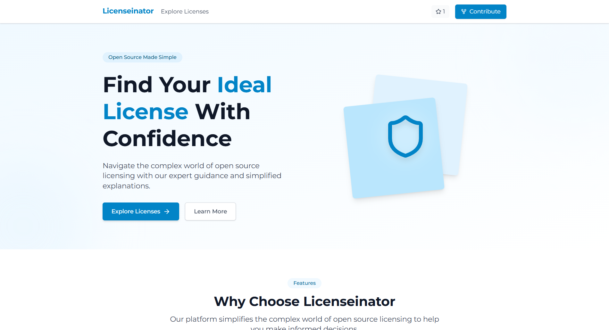

# Licenseinator

A modern web application to help developers find the ideal open source license for their projects.



## 🚀 Features

- **Simple Explanations**: Clear, jargon-free descriptions of each license and its terms
- **License Comparison**: Compare different licenses side-by-side to find the best match
- **Copyleft Strength Indicators**: Easily understand the restrictions of each license
- **Real-world Examples**: See which popular projects use each license
- **Compatibility Information**: Check if licenses work with other common licenses

## 📋 Available Licenses

Licenseinator includes detailed information about many popular open source licenses, including:

- MIT License
- Apache License 2.0
- GNU GPL (v2.0 and v3.0)
- BSD Licenses
- Mozilla Public License
- GNU AGPL
- And many more!

## 🛠️ Tech Stack

- [Next.js](https://nextjs.org/) - React framework
- [TypeScript](https://www.typescriptlang.org/) - Type safety
- [Tailwind CSS](https://tailwindcss.com/) - Styling
- [Lucide Icons](https://lucide.dev/) - Beautiful SVG icons
- [Bun](https://bun.sh/) - JavaScript runtime & package manager

## 🚀 Getting Started

### Prerequisites

- [Bun](https://bun.sh/) installed on your machine

### Installation

1. Clone the repository:

```bash
git clone https://github.com/Grenish/licenseinator.git
cd licenseinator
````

2. Install dependencies:

```bash
bun install
```

3. Run the development server:

```bash
bun dev
```

4. Open [http://localhost:3000](http://localhost:3000) with your browser to see the application.

## 🤝 Contributing

Contributions are welcome! If you'd like to help improve Licenseinator:

1. Fork the repository
2. Create your feature branch (`git checkout -b feature/amazing-feature`)
3. Commit your changes (`git commit -m 'Add some amazing feature'`)
4. Push to the branch (`git push origin feature/amazing-feature`)
5. Open a Pull Request

## 📝 License

This project is licensed under the MIT License - see the LICENSE file for details.

## 🙏 Acknowledgments

- All the open source communities that created and maintain these licenses
- [Open Source Initiative](https://opensource.org/) for license standardization
- [Choose a License](https://choosealicense.com/) for inspiration

## 📬 Contact

Project Link: [https://github.com/Grenish/licenseinator](https://github.com/Grenish/licenseinator)

---

Built with ❤️ for the open source community

